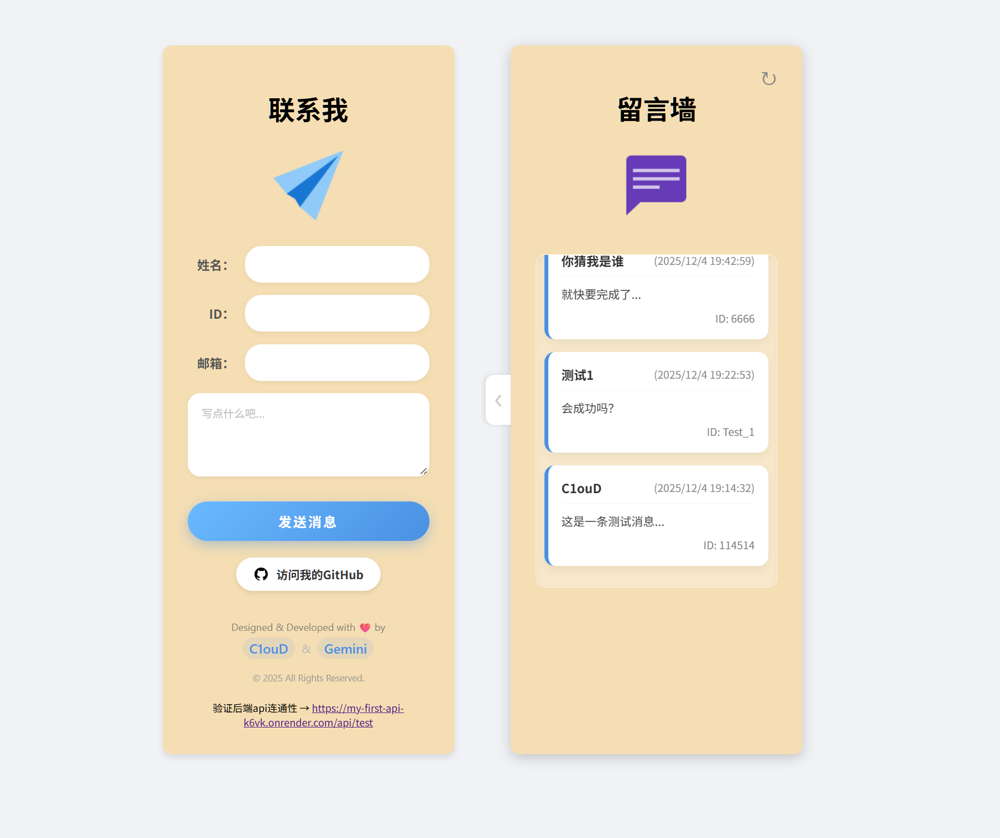

# ✨ My Personal Contact Board (我的全栈留言板)

> 🚀 这是我的第一个全栈开发练手项目！一个集成了个人名片展示与实时留言功能的响应式网页。

---

## 🖼️ 项目演示 (Demo)

👀 **[点击这里访问在线网页](https://c1oudreamw.github.io/My_server/)**

---

## 🛠️ 技术栈 (Tech Stack)

本项目采用了 **前后端分离** 的开发模式：

| 模块 | 技术选型 | 说明 |
| :--- | :--- | :--- |
| **前端 (Frontend)** | HTML5, CSS3, JavaScript (ES6+) | 原生开发，无框架依赖，手写 CSS 动画与布局 |
| **后端 (Backend)** | Node.js, Express | RESTful API 设计，处理数据请求 |
| **数据库 (Database)** | MongoDB (Mongoose) | 云端存储留言数据 |
| **部署 (Deployment)** | GitHub Pages + Render | 静态页面托管与后端云服务 |

---

## ✨ 功能特性 (Features)

* **📱 响应式布局**：完美适配桌面端与移动端，根据屏幕宽度自动调整排版。
* **🎨 抽屉式交互**：在 PC 端，留言板采用隐藏式抽屉设计，点击展开，动效丝滑。
* **💾 数据持久化**：留言数据实时存入 MongoDB 数据库，不再丢失。
* **🔔 交互反馈**：表单提交包含输入验证、Toast 轻提示（成功/失败反馈）以及加载动画。
* **🔄 实时刷新**：支持手动刷新留言列表，无需重载整个页面。

---

